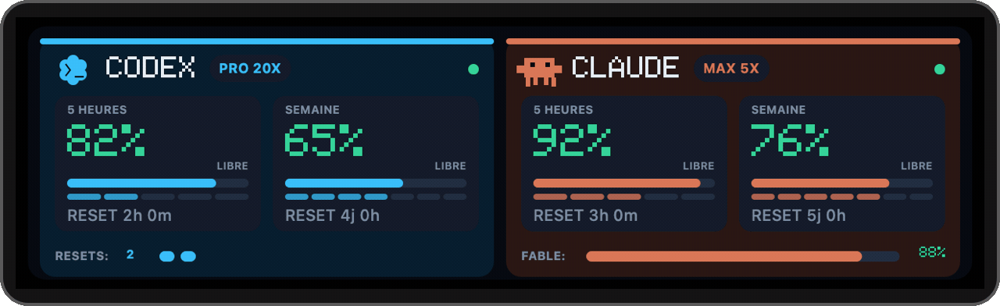

# Quota Display

Quota Display affiche les limites d’utilisation de **Codex** et de **Claude**
dans un Companion macOS et, facultativement, sur un mini-écran
**LILYGO T-Display S3 Long**.

[Guide du Designer : démarrage, modèles, connexions et dépannage](https://pducharme.github.io/codex-claude-quota-display/)

[Télécharger la dernière version](https://github.com/pducharme/codex-claude-quota-display/releases/latest)



Les quotas en un coup d’œil, puis le noir pour la nuit :
[réglez l’horaire de veille dans le Companion](#veille-des-mini-écrans).

## Fonctionnalités

- Quotas restants sur 5 heures et sur la semaine.
- Forfaits Codex et Claude, quotas Fable et resets Codex en banque lorsque les
  fournisseurs les rendent disponibles.
- Jauges réelles accompagnées de segments indiquant où la consommation devrait
  théoriquement se situer dans la période.
- Companion natif dans la barre de menus macOS.
- Affichage au choix de Codex ou Claude, avec carte pleine largeur, fenêtre
  permanente, mode toujours au premier plan et pourcentage restant dans la
  barre des menus.
- Mode source locale ou client d’une autre instance Quota Display sur le réseau.
- Mini-écran tactile avec vue détaillée, météo sur cinq jours et actualisation
  par glissement.
- Veille quotidienne des mini-écrans, avec horaire réglable dans le Companion.
- Actualisation automatique toutes les cinq minutes.
- Relance préventive du LCD toutes les 30 minutes pour récupérer un écran noir
  sans débrancher l’ESP32.
- Mises à jour du Companion avec Sparkle, incluant les notes de version.

## Architecture

Un Mac agit comme source et garde les sessions des fournisseurs localement. Son
pont API transmet uniquement les quotas, les heures de remise à zéro et les
données météo aux autres appareils :

```text
Codex.app + Claude Desktop
            │
       Companion source
            │ API locale :8788
            ├── mini-écran ESP32
            └── autres Companions macOS
```

Le projet contient trois parties :

- `bridge/quota_menu.swift` : Companion macOS natif;
- `bridge/quota_bridge.py` : pont API local;
- `firmware/` : firmware PlatformIO du T-Display S3 Long.

## Installer le Companion macOS

### Prérequis

- macOS 13 ou une version plus récente;
- Python 3.9 ou plus récent (Python.org, Homebrew ou outils de ligne de commande Apple);
- Codex.app et/ou Claude Desktop installés et connectés.

Téléchargez le fichier `.pkg` de la
[dernière Release](https://github.com/pducharme/codex-claude-quota-display/releases/latest),
puis ouvrez-le. Le paquet universel prend en charge Apple Silicon et Intel. Il
installe le Companion et son pont API, puis configure leur démarrage à
l’ouverture de session.

Le paquet n’est pas encore notarié par Apple.
Si macOS le bloque, utilisez **clic droit → Ouvrir** ou autorisez-le dans
**Réglages Système → Confidentialité et sécurité**.

Le paquet vérifie Python avant de modifier l’installation. Si les outils de
ligne de commande Apple sont encore en cours d’installation, attendez la fin,
puis rouvrez le paquet. Leur installation se lance avec `xcode-select --install`.

Après l’installation :

1. Ouvrez **Quota Display** dans la barre de menus.
2. Vérifiez que Codex.app est connecté avec un compte ChatGPT.
3. Dans **Paramètres → API et connexions → Connexions**, choisissez **Autoriser Claude Desktop…** si vous
   utilisez Claude. macOS peut demander l’accès à `Claude Safe Storage`.
   Choisissez **Toujours autoriser** pour conserver cet accès. Depuis la 1.0.25,
   le Companion garde la même identité de signature entre les versions. Une
   nouvelle autorisation est nécessaire au passage depuis une ancienne signature.
4. Choisissez **Actualiser les quotas**.

Par défaut, le menu montre seulement le tableau de bord et une ligne
**Paramètres**. Les réglages sont regroupés dans **Affichage** (fournisseurs,
fenêtre permanente et premier plan), **API et
connexions** (source, copie de la configuration, démarrage automatique et
comptes), **Mini-écrans** (veille) et **Mises à jour**. L’actualisation des
quotas, les informations de l’application et la commande pour quitter restent
directement accessibles dans **Paramètres**.

Les cases **Afficher Codex** et **Afficher Claude** contrôlent aussi la barre
des menus : les deux cochées affichent la vue compacte des deux fournisseurs;
une seule cochée affiche son icône et son quota hebdomadaire restant.

## Utiliser une source distante

Une seule installation peut servir plusieurs mini-écrans et Companions :

1. Sur le Mac source, connectez Codex.app et Claude Desktop, puis autorisez les
   fournisseurs dans **Connexions**.
2. Choisissez **Copier la configuration API**.
3. Sur chaque Companion client, ouvrez **Source des quotas…**, puis saisissez
   l’adresse et le jeton copiés.
4. Utilisez la même adresse et le même jeton dans le portail de configuration
   des mini-écrans.

Sur le Mac source, **Paramètres → API et connexions → Clé API de ce Mac…**
permet de modifier la clé servie ou de restaurer une ancienne clé après une
réinstallation. Le changement prend effet immédiatement. Tous ses clients
doivent utiliser cette même clé. **Copier la configuration API** reste disponible
sur un Companion client même lorsque la source est hors ligne ou refuse sa clé.

En mode distant, les connexions aux fournisseurs sont gérées uniquement par le
Mac source. Le pont du Mac client reste disponible, mais ne lance plus de
lectures locales des fournisseurs tant qu’une source distante est configurée.
L’action **Actualiser les quotas** du client demande une nouvelle lecture à cette source. Le choix des fournisseurs affichés est aussi enregistré
sur la source : tous les Companions et mini-écrans adoptent le même affichage.

## Designer (version 1.1.0 en validation)

**Paramètres → Mini-écrans → Designer…** ouvre l'éditeur de pages : six polices,
modèles Quotas/Météo/Horloge/Focus, composition libre et suivi des avions à
proximité avec bascule automatique. Une première mise à jour du firmware est
requise; les publications de pages suivantes passent par HTTP.

Consultez le [guide du Designer et son état de validation](docs/designer-v1.md).
Le nouveau firmware doit encore être vérifié sur les deux écrans physiques;
la release firmware stable du 20 septembre décrite ci-dessous reste distincte.

## Installer le mini-écran

Matériel pris en charge : **LILYGO T-Display S3 Long**, écran 180×640 utilisé en
mode paysage. Le firmware prend en charge le contrôleur tactile CST3530 des
révisions actuelles.

### Firmware précompilé

La [version firmware du 20 septembre 2026](https://github.com/pducharme/codex-claude-quota-display/releases/tag/firmware-2026.09.20)
inclut les réglages web tactiles et désactive la DEL de charge clignotante dès
le démarrage, y compris pendant la veille. La charge de la batterie reste active.
Les deux images et leurs sommes SHA-256 sont disponibles dans cette release,
indépendamment des mises à jour de l’application Mac.

L’image complète se trouve dans
[`firmware/releases/quota-display-full.bin`](firmware/releases/quota-display-full.bin)
et doit être écrite à l’adresse `0x0` :

```sh
python3 -m venv .venv
. .venv/bin/activate
python -m pip install esptool
SERIAL_PORT=/dev/cu.usbmodemXXXX
python -m esptool --chip esp32s3 --port "$SERIAL_PORT" \
  write_flash 0x0 firmware/releases/quota-display-full.bin
```

Remplacez la valeur de `SERIAL_PORT` par le port USB détecté sur votre
ordinateur.

Pour **mettre à jour un écran déjà configuré**, utilisez uniquement l’image
application à `0x10000` afin de conserver le Wi-Fi, la clé et l’horaire de veille :

```sh
python -m esptool --chip esp32s3 --port "$SERIAL_PORT" \
  write_flash 0x10000 firmware/releases/quota-display.bin
```

N’utilisez pas l’image complète à `0x0` pour cette mise à jour : elle recouvre
aussi la zone des réglages.

### Compilation depuis les sources

```sh
python3 -m venv .venv
. .venv/bin/activate
python -m pip install platformio
SERIAL_PORT=/dev/cu.usbmodemXXXX
cd firmware
pio run
pio run --target upload --upload-port "$SERIAL_PORT"
```

### Configuration Wi-Fi

Au premier démarrage, l’écran crée un réseau nommé `QuotaDisplay-XXXXXX`. Le
mot de passe temporaire est affiché sur le LCD.

1. Connectez un téléphone ou un ordinateur à ce réseau.
2. Ouvrez `http://192.168.4.1`.
3. Saisissez le Wi-Fi local, l’adresse du Companion source, le jeton API et la
   ville utilisée pour la météo.
4. Enregistrez. L’écran redémarre et commence sa synchronisation.

### Modifier l’adresse de l’API ou sa clé

Aucun accès aux boutons du boîtier n’est nécessaire :

1. Maintenez le doigt **deux secondes sur l’écran tactile**, même pendant la veille.
2. L’écran affiche son adresse web et un code temporaire.
3. Depuis un téléphone ou un ordinateur sur le **même Wi-Fi**, ouvrez cette
   adresse. Connectez-vous avec **admin** et le code affiché sur l’écran.
4. Modifiez **Adresse de l’API** et/ou **Clé API**, puis choisissez
   **Enregistrer et redémarrer**.

Le Wi-Fi et la ville restent configurés. Laissez la clé vide pour conserver
la clé actuelle; elle n’est jamais renvoyée dans la page. La section **Wi-Fi et
météo** permet aussi de modifier ces réglages. Un mot de passe Wi-Fi vide
conserve celui du même réseau, sauf si **Ce réseau Wi-Fi n’a pas de mot de passe**
est coché.

L’accès expire après cinq minutes ou lorsque vous touchez à nouveau l’écran.
Les quotas sont en pause pendant l’affichage du code. Le code ne dépend pas de
l’ancienne clé API : vous pouvez donc remplacer une clé devenue invalide.
La page utilise HTTP et doit rester sur un réseau de confiance.

Cette fonction nécessite une première mise à jour du firmware par USB sur
chaque écran déjà installé; ensuite, les réglages se modifient par le Web.
Si le Wi-Fi est inaccessible au démarrage, le réseau `QuotaDisplay-XXXXXX`
s’ouvre automatiquement et conserve les réglages pour les corriger. Le maintien
de **BOOT** pendant trois secondes au démarrage reste un accès de secours au
portail, sans effacement préalable.

## Utilisation du mini-écran

- Touchez la carte Codex pour consulter les resets en banque et leur expiration.
- Glissez vers la gauche pour afficher la météo; glissez vers la droite pour
  revenir aux quotas.
- Tirez brièvement depuis le bord supérieur pour forcer une actualisation
  Codex et Claude sur la source.
- Un point vert indique une lecture valide, orange une dernière valeur conservée
  et rouge une source indisponible.
- Lorsqu’un fournisseur est masqué ou indisponible, l’autre occupe
  automatiquement toute la largeur, sans reflash.
- `NON FOURNI` signifie que le fournisseur n’a pas retourné cette fenêtre de
  quota; l’application n’invente alors aucune valeur.

## Veille des mini-écrans

Dans **Paramètres → Mini-écrans → Veille des mini-écrans…**, activez la veille puis choisissez
l’heure d’extinction et de réveil (23:00–07:00 proposé). Elle est désactivée
par défaut et s’applique à tous les mini-écrans liés à la source sélectionnée.
Les heures suivent le fuseau indiqué dans la fenêtre, y compris les changements
d’heure. Les deux heures doivent être différentes.

Le Companion source et le firmware des écrans doivent être mis à jour une
première fois. Ensuite, les changements d’horaire arrivent par la synchronisation
habituelle, sans reflash. Chaque écran conserve l’horaire en mémoire et l’exécute
même si le Mac dort ou si la source est temporairement indisponible.

Pendant la veille, le rétroéclairage est éteint, le LCD est au repos et les
animations, gestes et relances préventives du LCD sont suspendus. La connexion
reste active pour recevoir les modifications. Le réveil est automatique; pour
réveiller les écrans plus tôt, désactivez la veille dans le Companion.
Après une coupure d’alimentation, l’écran attend une heure valide fournie par
la source ou par NTP avant d’appliquer l’horaire.

## API locale

Le pont écoute par défaut sur le port `8788` et actualise les fournisseurs
toutes les cinq minutes.

| Méthode | Endpoint | Authentification | Rôle |
| --- | --- | --- | --- |
| `GET` | `/health` | Non | État du pont |
| `GET` | `/v1/quotas` | Jeton Bearer | Quotas et état des fournisseurs |
| `GET` | `/v1/weather?city=<ville>` | Jeton Bearer | Conditions et prévisions météo |
| `POST` | `/v1/refresh` | Jeton Bearer | Nouvelle lecture des fournisseurs |
| `POST` | `/v1/display` | Jeton Bearer | Fournisseurs visibles et horaire de veille des mini-écrans |

L’adresse et le jeton se copient depuis **Copier la configuration API** dans le
Companion.

Le pont utilise HTTP sur le réseau local. Ne redirigez pas le port `8788` vers
Internet; utilisez un réseau de confiance ou un VPN. Les jetons OpenAI et
Anthropic ne sont jamais envoyés aux écrans ni aux Companions clients.

## Diagnostic des actualisations

À partir de la version 1.0.23, le Companion et le pont source signalent leurs
échecs d’actualisation à GlitchTip : type d’erreur, code HTTP ou système,
version de l’application et de macOS/Python, mode local ou distant, temps
écoulé depuis la dernière lecture et identifiant aléatoire de session.
Les erreurs du pont incluent les noms des fichiers/fonctions concernés, sans
chemin personnel ni variables locales.

Aucun jeton, compte, adresse de source, pourcentage de quota, contenu de
conversation ou sortie brute des fournisseurs n’est transmis. GlitchTip tronque l’adresse IP de connexion avant de l’associer
à l’événement. Une même erreur est limitée
à un envoi par quinze minutes et par processus. Les envois se font en arrière-plan;
un échec de GlitchTip n’interrompt pas l’actualisation.

Décochez **Paramètres → Partager les erreurs techniques** pour désactiver
l’envoi du Companion et du pont sur ce Mac. En mode distant, ce réglage doit
être désactivé séparément sur le Mac source. Pour un pont sans Companion,
créez le fichier vide
`~/Library/Application Support/Quota Display/diagnostics-disabled`.

La collecte commence après la mise à jour; elle ne récupère pas les erreurs
anciennes. Mettez aussi à jour le Mac source lorsqu’il est distinct du client.
Les mini-écrans n’envoient pas de diagnostic directement.

## Développement

L’installation depuis les sources nécessite les outils de ligne de commande
Xcode :

```sh
cd bridge
./install.sh
```

Vérifications principales :

```sh
python3 bridge/test_quota_bridge.py
python3 bridge/test_installer.py
python3 firmware/test_status_led.py
c++ -std=c++11 -Wall -Wextra -pedantic firmware/test_configuration.cpp -o /tmp/quota-configuration-test
/tmp/quota-configuration-test
c++ -std=c++11 -Wall -Wextra -pedantic firmware/test_sleep.cpp -o /tmp/quota-sleep-test
/tmp/quota-sleep-test
python3 bridge/quota_bridge.py --once
```

Pour construire une Release, créez d’abord
`release-notes/<version>.html`, puis lancez :

```sh
bridge/build_pkg.sh 1.2.3
bridge/generate_appcast.sh 1.2.3
```

Le script de construction compile le Companion pour `arm64` et `x86_64`,
valide sa signature et exécute son autotest natif. La clé privée correspondant
à `bridge/QuotaDisplay-Signing.cer` doit être présente dans le trousseau du
responsable des releases. Le certificat public est versionné; la clé privée
reste dans le trousseau et ne doit pas être remplacée à chaque version.

La signature Apple Developer ID stabilise les autorisations du trousseau. Le test
`python3 bridge/test_signing.py` vérifie qu’une deuxième version conserve
l’accès à un élément synthétique et qu’un binaire non autorisé reste refusé.

## Avis

Quota Display est un projet indépendant, sans affiliation avec OpenAI,
Anthropic ou LILYGO. Les noms et marques appartiennent à leurs propriétaires
respectifs. Les intégrations reposent sur les sessions locales des applications
et peuvent nécessiter une adaptation si leurs interfaces changent.

Pour Claude, le pont privilégie le cache récent du Companion connecté à
Claude Desktop. En son absence, il lit les quotas JSON avec la session Claude
Code conservée dans le trousseau. Il n’exécute pas de requête de modèle et ne
renouvelle pas les jetons des autres applications. Une session expirée doit
être renouvelée dans Claude Code ou Claude Desktop. Les fenêtres absentes de
la réponse restent « NON FOURNI ».

Consultez aussi [`THIRD_PARTY_NOTICES.md`](THIRD_PARTY_NOTICES.md), le
[dépôt matériel LilyGO](https://github.com/Xinyuan-LilyGO/T-Display-S3-Long)
et la [documentation Open-Meteo](https://open-meteo.com/en/docs).
